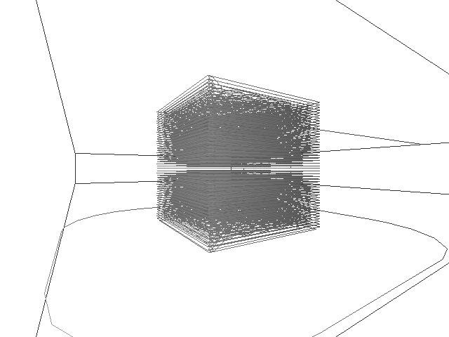

# GcodeMod

Les buts de ce programme sont:
- modifier un fichier gcode pour intégrer un MCODE pour activer/désactiver les moteurs pas à pas
quand ils en sont pas utilisés.
- faire des transformations géométriques sur des fichiers .gcode
- visualiser le chemin du .gcode

---------- INSTALL ----------

  juste compiler le programme
  Linux(Debian):

	les dépendances sont: libeigen, irrlicht3D
	installation des dépendances:

	sudo apt-get install libeigen3-dev libirrlicht-dev # sur debian 

	./configure
	make
	sudo make install

-----------------------------

--------- UNINSTALL ---------

  Linux(Debian):

	sudo make uninstall
-----------------------------

-------------- USE --------------

  S'utilise en ligne de commande pour connaître les différents usages, faites:

	gcode -h

---------------------------------

Exemple:
gcode -i cube.gcode -a view

